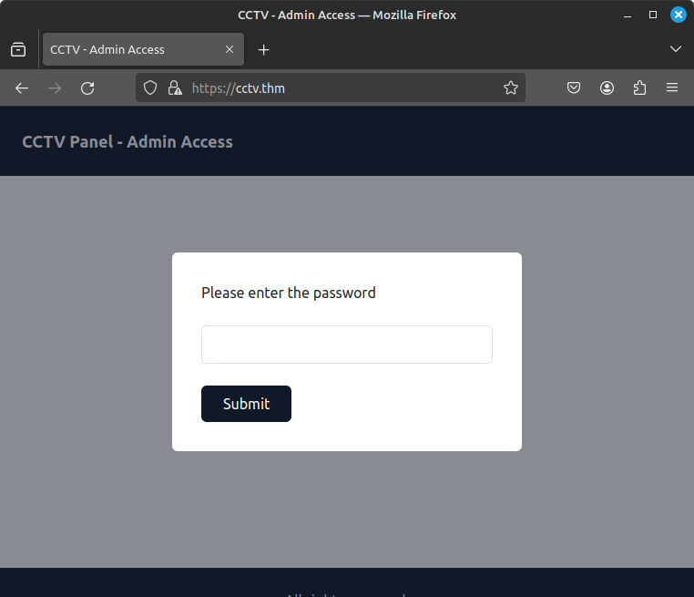
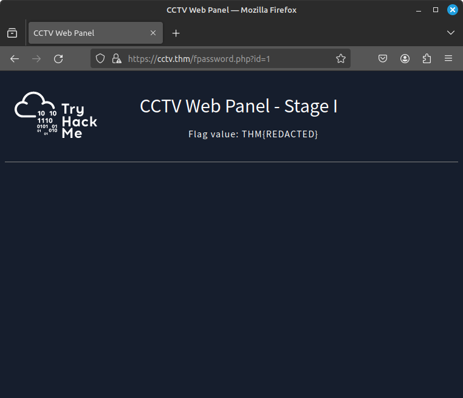
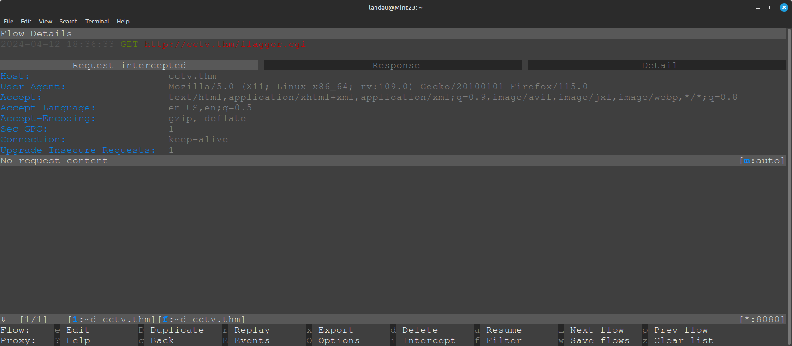
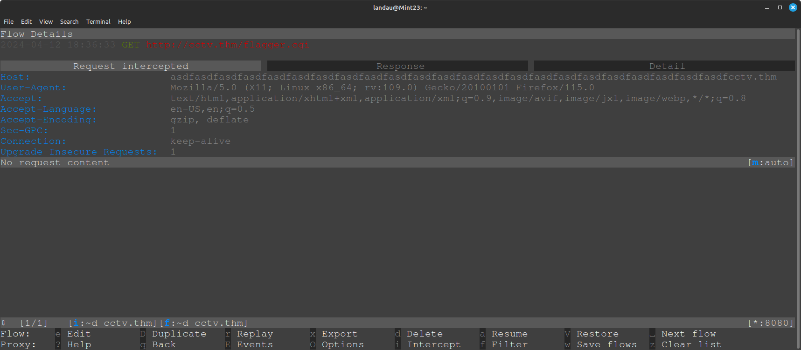
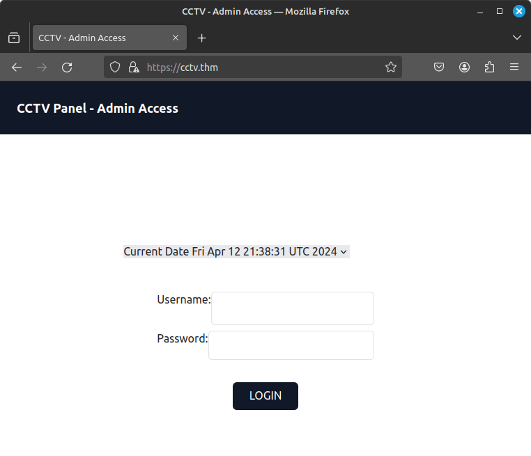
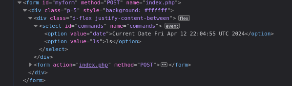
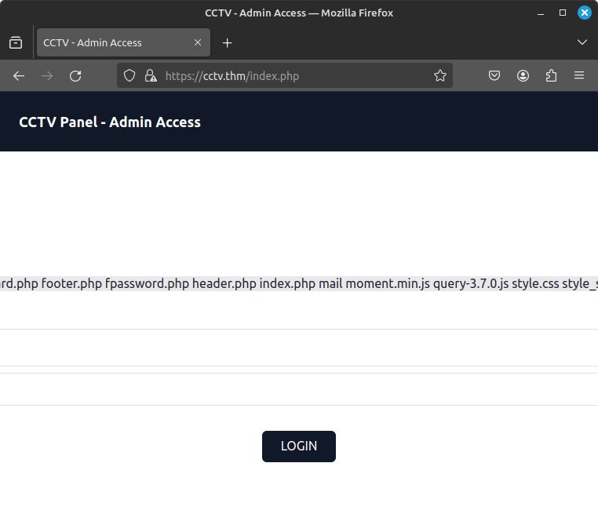
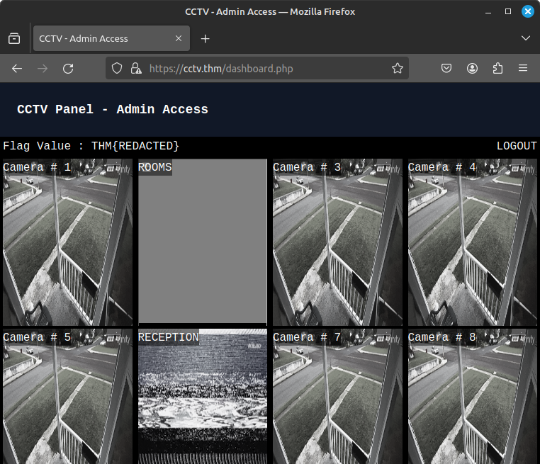

# TryHackMe Bypass
### [https://tryhackme.com/r/room/bypass](https://tryhackme.com/r/room/bypass)
### Room by TryHackMe and 1337rce
### Writeup by BarbosaRMS

---

We start by doing basic enumeration on the target machine. To make things smoother that it works fine on the browser, add an entry "cctv.thm" on your hosts file (/etc/hosts on Linux, c:\Windows\System32\Drivers\etc\hosts on Windows).

First, what are the services running on the server?
> nmap -sV -sC -p-65535 cctv.thm

```
Starting Nmap 7.80 ( https://nmap.org ) at 2024-04-12 11:47 -03
Stats: 0:00:15 elapsed; 0 hosts completed (1 up), 1 undergoing Connect Scan
Connect Scan Timing: About 99.99% done; ETC: 11:47 (0:00:00 remaining)
Nmap scan report for cctv.thm (10.10.194.80)
Host is up (0.31s latency).
Not shown: 997 filtered ports
PORT    STATE SERVICE VERSION
22/tcp  open  ssh     OpenSSH 8.2p1 Ubuntu 4ubuntu0.9 (Ubuntu Linux; protocol 2.0)
80/tcp  open  http    Apache httpd 2.4.41
|_http-server-header: Apache/2.4.41 (Ubuntu)
|_http-title: 403 Forbidden
443/tcp open  ssl/ssl Apache httpd (SSL-only mode)
|_http-server-header: Apache/2.4.41 (Ubuntu)
|_http-title: 400 Bad Request
| ssl-cert: Subject: commonName=cctv.thm/organizationName=cctv.thm/stateOrProvinceName=Tokyo/countryName=AU
| Not valid before: 2023-08-30T10:08:16
|_Not valid after:  2024-08-29T10:08:16
| tls-alpn: 
|_  http/1.1
Service Info: Host: default; OS: Linux; CPE: cpe:/o:linux:linux_kernel

Service detection performed. Please report any incorrect results at https://nmap.org/submit/ .
Nmap done: 1 IP address (1 host up) scanned in 44.03 seconds
```

we DO have an ssh, but let's focus right now on the web services: we have an Apache service running on 80, and another port with https on 443. Interesting.

If we check the server on port 80 with the browser, we do see that it doesn´t seem to work... but on 443, it shows up!



We do have a password box, and it doesn´t seem to bother to do anything when we type the wrong password... BUT if we check the page source code, we do see a reference to a /mail endpoint
```html
  <!-- Main Content -->
<main class=" mx-auto py-8  min-h-[80vh] flex items-center justify-center gap-10 flex-col xl:flex-row">
<!-- Here we will add redirection to /mail endpoint -->
```

So what's in this /mail endpoint? AHA! We do have a dump.txt file with some instructions to recover the password
```
From: steve@cctv.thm
To: mark@cctv.thm
Subject: Important Credentials

Hey Mark,

I have completed all the formalities for securing our CCTV web panel (cctv.thm:443). I have installed Suricata to automatically detect any invalid connection and enabled two-layer protection for the web panel. I will SMS you the passwords but incase if you misplace them, there is no possibility for recovery. 

We can recover the password only if we send some specially crafted packets 	
-	Make a UDP request to the machine with source port number 5000. Once done, you can fetch the flag through /fpassword.php?id=1
-	Make a TCP request to fpassword.php?id=2 with user-agent set as "I am Steve Friend". Once done, you can fetch the flag through /fpassword.php?id=2
-	Send a ping packet to the machine appearing as Mozilla browser (Hint: packet content with user agent set as Mozilla). Once done, you can fetch the flag through /fpassword.php?id=3
-	Attempt to login to the FTP server with content containing the word "user" in it. Once done, you can fetch the flag from /fpassword.php?id=4
-	Send TCP request to flagger.cgi endpoint with a host header containing more than 50 characters. Once done, you can fetch the flag from /fpassword.php?id=5

After receiving all the flags, you can visit the MACHINE IP that will ask you for the password. The first password will be concatenated values of all five flags you have received above.

For the second layer of security, I have enabled a wholly sandboxed login environment with no connection to the database and no possibility of command execution. The username is the computer's hostname, and the password is the same as the previous password. I will SMS you the details as well.


See ya soon

Steve
Dev Ops Engineer
```

Alright, so we have a plan now. There are 5 steps to recover the password, and after that it seems there is also a last step to recover somehow the computer's hostname.

Let's do it in parts:
1) "Make a UDP request to the machine with source port number 5000."
	There are some ways to work with packets using different languages... In my case, since i was researching a tool precisely for this last night, I've decided to use Scapy: It's a python tool that allows us to create custom packets with (some) ease. just do a 
	```bash
	pip install scapy
	```
	and... now, the bothersome part: for me it needed sudo to send the packets. There are some workarounds for this on the interwebs, but i just went with 
	```bash
	sudo $(which scapy)
	```
	 and it worked for me. 
	Now, on Scapy shell, we create our packet: (remember to change the ip for your instance)

	```python
	send(IP(dst="10.10.173.248")/UDP(sport=5000))
	```

	pay attention that it requires the SOURCE port to be 5000, not the DESTINATION port!
	With this, we can do as it says and check on the browser the endpoint cctv.thm/fpassword.php?id=1 and we do see that we have our flag!

	

2) "Make a TCP request to fpassword.php?id=2 with user-agent set as 'I am Steve Friend'."
	We can write a very basic python requests code for this:
	```python
	import requests
	url = "http://10.10.173.248/fpassword.php?id=2"
	headers = {"User-Agent":"I am Steve Friend"}
	resp = requests.get(url, headers=headers)
	```
	Simple and clean. Now we check /fpassword.php?id=2 again and, voilà!

3) "Send a ping packet to the machine appearing as Mozilla browser (Hint: packet content with user agent set as Mozilla)"
	We can use Scapy here again. If we look for ping on Scapy's documentation, there is a one-liner there that we can use:
	```python
	ans, unans = sr(IP(dst="10.10.173.248")/ICMP()/Raw(load="User-Agent: Mozilla/5.0"), timeout=3)
	```
	note that we had to add the User-Agent on the raw data for the packet for it to work!
	And we just check now fpassword.php/id=3 and the flag is there!

4) "Attempt to login to the FTP server with content containing the word 'user' in it."
	This is the easiest one, we can just try to login on ftp with the user as 'user'
	```bash
	ftp user@cctv.thm
	```
	and BOOM! check fpassword.php?id=4 to find our flag!

5) "Send TCP request to flagger.cgi endpoint with a host header containing more than 50 characters."
	For some reason this one gave me some trouble. After trying to work with Scapy and Requests on python, I've decided to use a proxy (like Burp or mitmproxy) so I can intercept the packet and change the host header. In my case I've used mitmproxy (It's good to try new tools! Don´t rely only on Burp for all your hacking!):
	
	Now checking if it worked on fpassword.php?id=5 ... and IT DID!

Alright, we do have all the 5 flags now... the dump.txt file said that we would get the password by concatenating all the passwords found above... so there are two ways this could work: literally concatenate all the flags, to get: 
```
THM{REDACTED}THM{REDACTED}THM{REDACTED}THM{REDACTED}THM{REDACTED}
```

or we could try to join only the inner parts:
```
THM{REDACTEDREDACTEDREDACTEDREDACTEDREDACTED}
```

turns out that trying the first one worked just fine. :)

Now we have our second login page, and we already know what to fill on the username: the computer's hostname!... that we don't know yet. But, they gave us a hint: "I have enabled a wholly sandboxed login environment with no connection to the database and **no possibility of command execution.**"



There was this video from John Hammond, where he explains how he passed OSCP... and he said something like "Everything that is on the box is there **FOR A REASON**" (and that's a very good thing to remember when working on challenges and ctfs); Here we are, with a login page with username and password... and a date? In a listbox? Hmm...
If we check the html, we do see that it is indeed a list, but with only one option, and below there is a javascript that makes it submit the page when there is a change on the listbox... and if we keep reloading the page, we note that the minutes/seconds keep changing... maybe it pulls out the date from the 'date' command?

So let's try something... open up the developer tools (F12), modify the html to add a **new** option there
```html
<option value="ls">ls</option>
```

so it looks like this...



Now update the page, change the option to 'ls' and... we have our directory list! IT WERKS!



Note that is is Remote Code Execution, and if we wanted we could get shell access on the box. But for this room, this is not needed.

Create a new option for lsb_release, so we can answer the question on the room...
```html
<option value="lsb_release -r -s">lsb_release -r -s </option>
```

and finally we get the hostname of the machine
```html
<option value="hostname">hostname</option> 
```

With the hostname, now we know the username for our login page, and finally we get the last flag!


